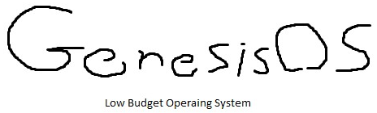
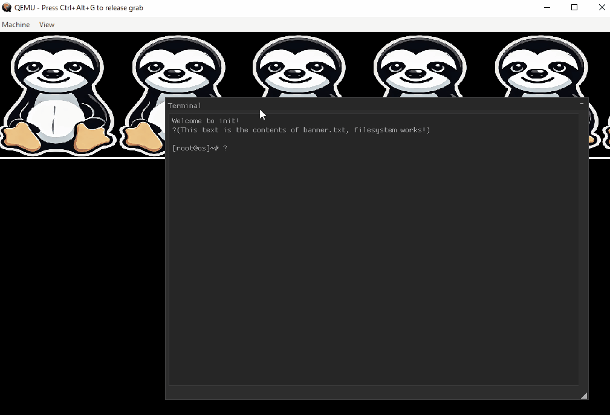

# GenesisOS

 

Small project I made because I wanted to learn about kernels and how they work.

This operating system have the following features:
* Kernel allocator
* Virtual Memory
* Interrupts / IRQs
* Disk: ATA PIO
* Syscalls
* Scheduler (_Round-Robin_ algorithm)
* Serial/UART driver 
* Filesystem: Support FAT32
* ELF Loader
* Userland shell/init binary
* Devices/File descriptors
* VGA Driver
* BMP Renderer

All this work, just to load a userland ELF binary that echoes back whatever you write to it by calling `SYS_read` and `SYS_write`:

More info:
* [Build Instructions](docs/build_instructions.md)
* [IDE Configuration](docs/ide.md)

# References

To write this project, I used:
* _Intel SDM Vol 3_(`325384-sdm-vol-3abcd.pdf`)
* OSDev Discord community([link](https://discord.gg/osdev))
* OSDev: https://wiki.osdev.org/
* "_The little book about OS development_": https://littleosbook.github.io/
* SerenityOS and Academic projects such as JOS and xv6 (to get inspiration for design ideas)
* _nanobyte-dev_ YT channel to get introduction on FAT filesystems.
