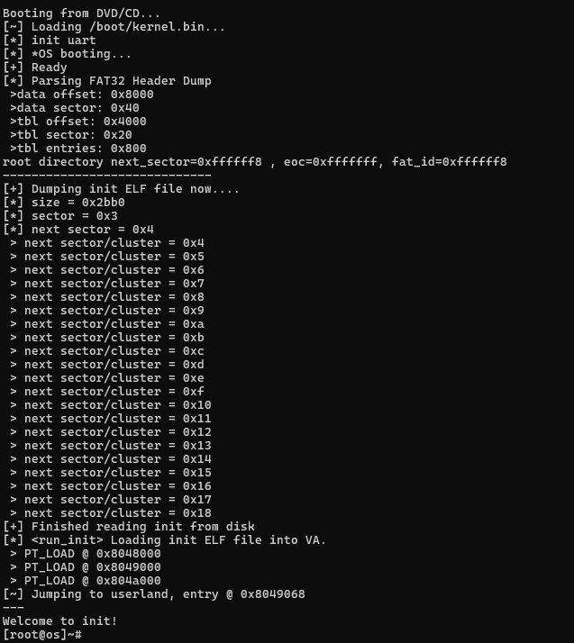

# GenesisOS
<p align="center">

<br />

<a href='https://discord.gg/PpeeR64k'></a>

</p>

Dumb project I made because I wanted to learn about kernels and how they work. You are welcomed to contribute to my chaos and join the cult.

This operating system have the following features:
* Kernel allocator
* Virtual Memory
* Interrupts / IRQs
* Disk: ATA PIO
* Syscalls
* Scheduler (_Round-Robin_ algorithm)
* Console/UART driver 
* Filesystem: Support FAT32
* ELF Loader
* Userland shell/init binary
* Devices/File descriptors(not rly/partial)

All this work, just to load an ELF binary that echoes back whatever you write to it by calling `SYS_read` and `SYS_write`:



To write this project, I used:
* _Intel SDM Vol 3_(`325384-sdm-vol-3abcd.pdf`)
* OSDev Discord community([link](https://discord.gg/osdev))
* OSDev: https://wiki.osdev.org/
* "_The little book about OS development_": https://littleosbook.github.io/
* Academic projects: SerenityOS, JOS and xv6 (to get inspiration for design ideas)
* _nanobyte-dev_ YT channel to get introduction on FAT filesystems.


# Build & Run

Launch an `ubuntu:20.04` container and follow the steps below
```sh
docker run -v $(pwd):/share/ --rm --privileged --name osdev -it ubuntu:20.04
```

1. First, run `./deps-container.sh` to install the required dependencies.
2. prepare the directory tree by running `make dirsetup`
3. Compile & pack everything by running `make iso`
4. To run the OS in qemu, run `make qemu-nox`

>Note: _nox_ stands for _no-graphics_. If you run `make qemu` a qemu window will pop. However, it has bugs because the video driver is not finished(unlike the UART/console driver, which is more mature)


# Debug

To debug:
1. Run `make qemu-gdb`
2. Connect with gdb by running `target remote :12345`

# Security

Found a security issue? Good, fix it and send a PR.

>There are plenty of vulns around the codebase. I'm considering opening a special activities/event for vuln researchers who are interested in OSDev so we can learn and grow together. Should update about it in the Discord server.

# Compile DB

For easier code navigation and auto-completion, use _clangd_'s vscode plugin + [compiledb](https://github.com/nickdiego/compiledb).

```
compiledb make iso
```
